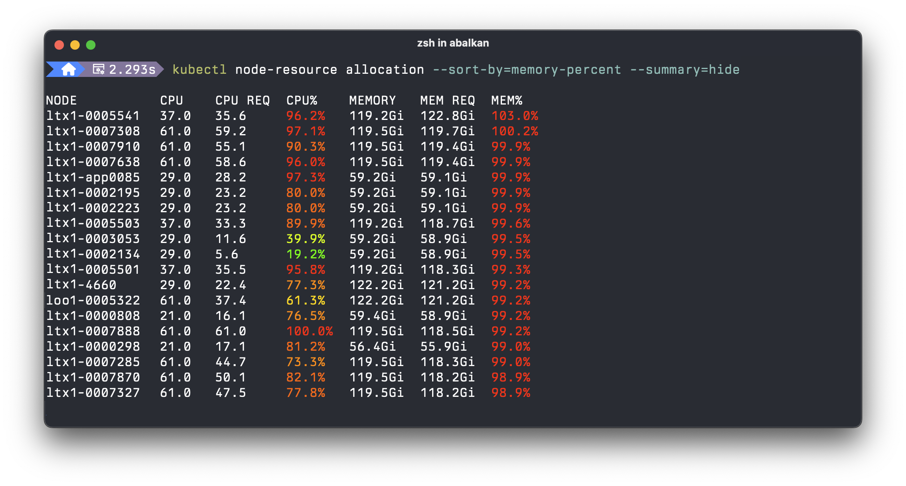
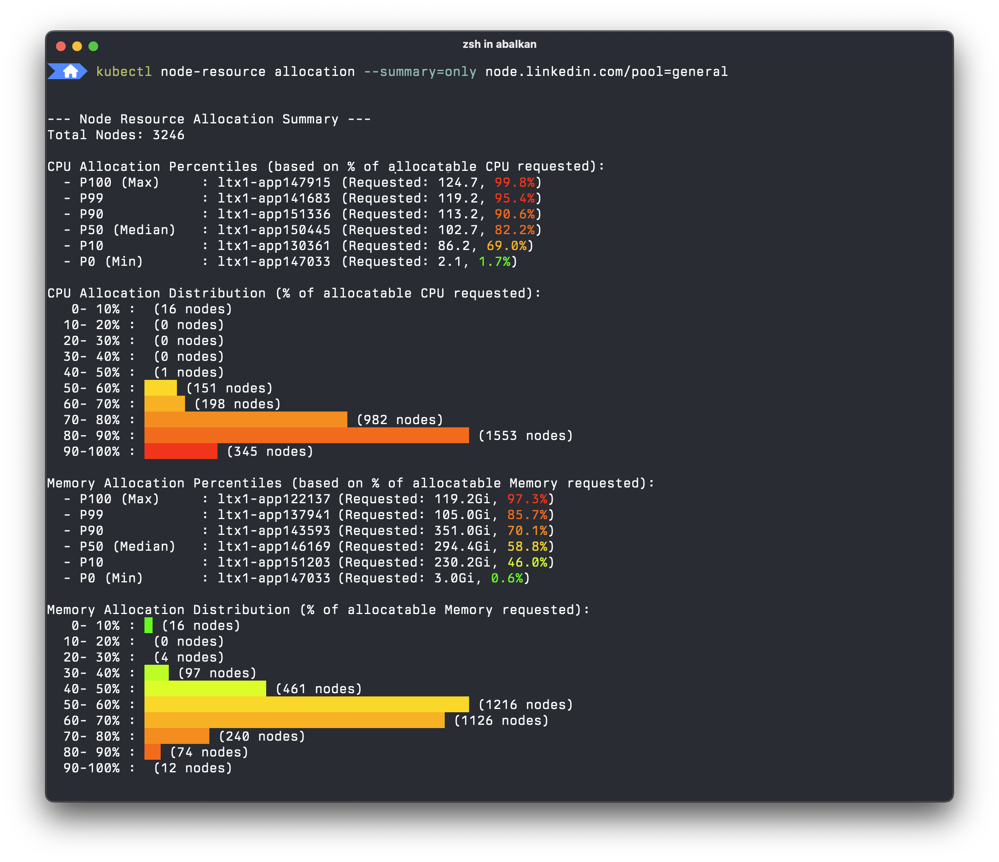
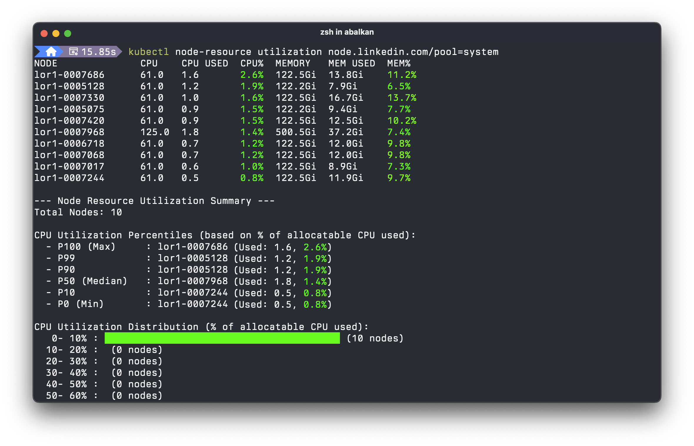
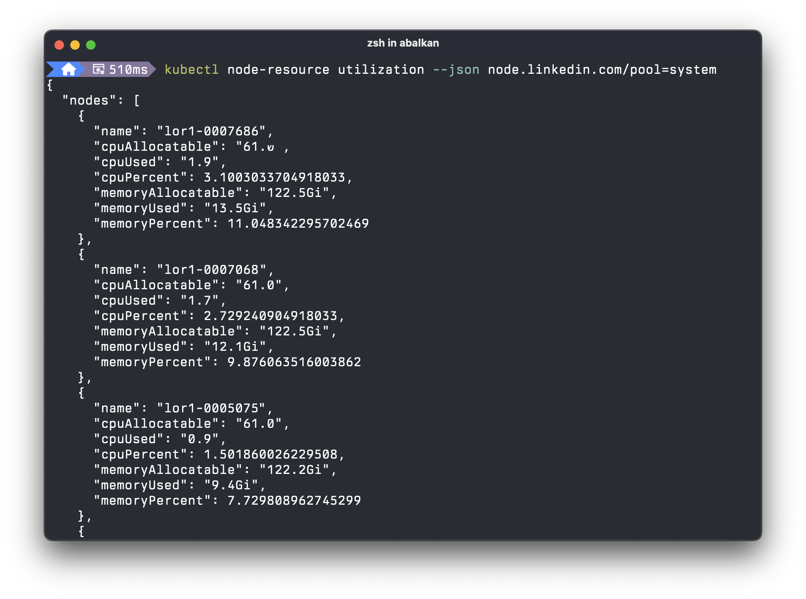

# kubectl node-resource

`kubectl node-resource` is a kubectl plugin that provides insights into
Kubernetes node resource allocation (based on pod requests) and actual
utilization (based on metrics-server data).

It helps administrators and developers understand how resources are being
consumed across their cluster's nodes and node pools.

<table>
  <thead>
    <tr>
      <th>Node Allocations View</th>
      <th>Node Utilization View</th>
    </tr>
  </thead>
  <tbody>
    <tr>
      <td>
        List only view:
        
        <br/>
        Summary-only view:
        
      </td>
      <td>
        List with summary view:
        
        <br/>
        Structured output:
        
      </td>
    </tr>
  </tbody>
</table>

## Installation

If you have [Krew](https://krew.sigs.k8s.io/) installed, you can install
`node-resource` with the following command:

```bash
kubectl krew install node-resource
```

## Features

- **Summary View**: Provides a summary view with histograms and distribution
buckets for resource allocation and utilization.
- **Structured JSON Output**: Supports JSON output (with `--json`) for easy
integration with other tools and scripts.
- **Fast Pod Querying**:
Utilizes optimized and parallel pod querying from the API server's watch cache
for the `allocation` command. Works well with large clusters.
- **Color Output**: Uses color-coded output in the terminal to visually indicate
resource pressure on each node.
- **Flexible Sorting and Filtering**: Sort nodes by CPU/memory usage percentage.
- **Free Resource Display**: In addition to showing used resources, it can also display
  the free resources (`--show-free`) on each node.
- **Selective Resource Display**: Allows users to choose which resources (CPU,
  Memory, Ephemeral Storage, Host Ports) are displayed in the output using flags
  like `--show-cpu`, `--show-memory`, `--show-gpu`, `--show-ephemeral-storage`,
  and `--show-host-ports`.

## Usage

This plugin offers two main subcommands:

- [**`utilization`**](#utilization-subcommand): Show actual resource utilization
  on nodes.
- [**`allocation`**](#allocation-subcommand): Show pod resource allocations on
  nodes.

### `allocation` subcommand

Displays the resource allocation on nodes based on the sum of pod resource
requests. It shows each node's allocatable CPU and memory, the sum of CPU and
memory requests from pods running on them, and the percentage of allocatable
resources requested.

**Examples:**

<table>
  <thead>
    <tr>
      <th>Usage</th>
      <th>Command</th>
    </tr>
  </thead>
  <tbody>
    <tr>
      <td>Show allocation for all nodes, sorted by CPU percentage (default sort).</td>
      <td><pre>kubectl node-resource allocation</pre></td>
    </tr>
    <tr>
      <td>Show allocation for nodes with the label <code>role=worker</code>, and also display host ports used by containers on these nodes.</td>
      <td><pre>kubectl node-resource allocation "role=worker" \
	--show-host-ports</pre></td>
    </tr>
    <tr>
      <td>Show only the summary of allocation for nodes matching the label <code>pool=high-memory</code>, hiding the detailed table.</td>
      <td><pre>kubectl node-resource allocation "pool=high-memory" \
	--summary=only</pre></td>
    </tr>
    <tr>
      <td>Show allocation for a specific node named <code>node1</code>, sorted by memory percentage, and include free (allocatable - requested) resources.</td>
      <td><pre>kubectl node-resource allocation \
      "kubernetes.io/hostname=node1" \
	--sort-by=mem-percent \
	--show-free</pre></td>
    </tr>
  </tbody>
</table>

#### Resource Display Flags

Both `allocation` and `utilization` commands support flags to control which resource details are displayed:

- `--show-cpu`: (Default: `true`) Show CPU related information (allocatable, requested/used, percentage).
- `--show-memory`: (Default: `true`) Show Memory related information (allocatable, requested/used, percentage).

The `allocation` command additionally supports:

- `--show-host-ports`: (Default: `false`) Show host ports used by containers on each node.
- `--show-ephemeral-storage`: (Default: `false`) Show ephemeral storage allocation details.
- `--show-gpu`: (Default: `false`) Show GPU allocation details.
- `--gpu-resource-key`: (Default: `"nvidia.com/gpu"`) Specify the resource key for GPU counting (e.g., `amd.com/gpu`).

These flags allow you to tailor the output to focus on the specific resources you are interested in. For example, to see only memory, ephemeral storage, and GPU (using the default key) for allocations:
```bash
kubectl node-resource allocation --show-cpu=false --show-memory --show-ephemeral-storage --show-gpu
```

For example, to show AMD GPUs, run:
```bash
kubectl node-resource allocation --show-gpu --gpu-resource-key=amd.com/gpu
```

### `utilization` subcommand

Displays the actual resource utilization of nodes, similar to `kubectl top
node`. It shows each node's allocatable CPU and memory, the actual CPU and
memory currently used, and the percentage of allocatable resources utilized.
This command requires the Kubernetes [metrics-server] to be installed and running
in the cluster.

[metrics-server]: https://github.com/kubernetes-sigs/metrics-server

**Examples:**

<table>
  <thead>
    <tr>
      <th>Usage</th>
      <th>Command</th>
    </tr>
  </thead>
  <tbody>
    <tr>
      <td>Show utilization for all nodes, sorted by CPU percentage (default sort).</td>
      <td><pre>kubectl node-resource utilization</pre></td>
    </tr>
    <tr>
      <td>Show utilization for nodes with the label <code>role=worker</code>.</td>
      <td><pre>kubectl node-resource utilization "role=worker"</pre></td>
    </tr>
    <tr>
      <td>Show utilization and include a column for free (allocatable - used) resources.</td>
      <td><pre>kubectl node-resource utilization \
	--show-free</pre></td>
    </tr>
    <tr>
      <td>Show utilization for all nodes, sorted by memory percentage, and output in JSON format.</td>
      <td><pre>kubectl node-resource utilization \
	--sort-by=mem-percent \
	--json</pre></td>
    </tr>
  </tbody>
</table>

## License

This project is licensed under the Apache 2.0 License. See the
[LICENSE](LICENSE).
